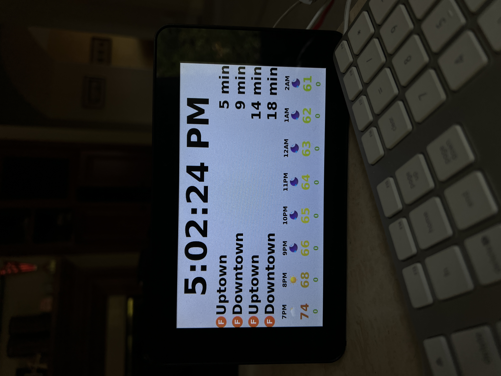
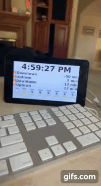

# NYCAtAGlance
A display to check in the morning with all the information you'll need for the day. Made this program for my Raspberry Pi, but will work on any device with Python 3.

## This includes: 
-> Live 6-hour weather forecast powered by tomorrow.io 
    -> "Feels like" temperature (color coordinated too)
    -> UV Index
    -> Sky conditions and icons
-> Live subway data powered by the MTA API 
-> Clock 

  </img>
  

